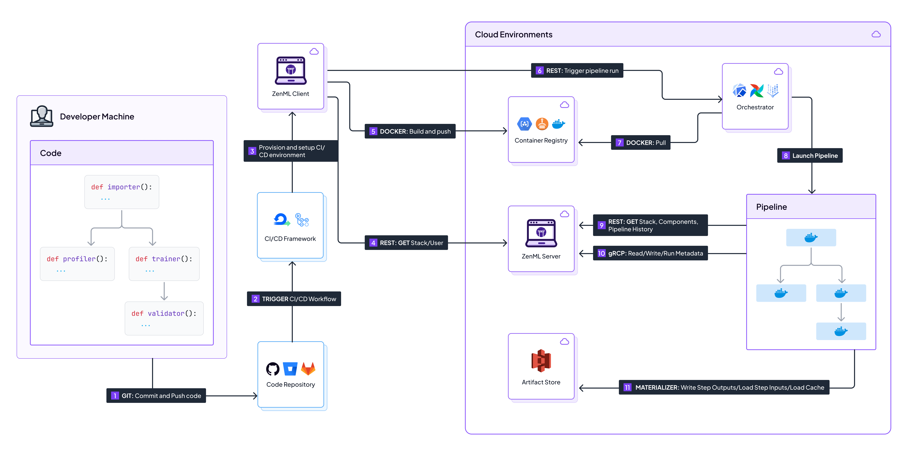
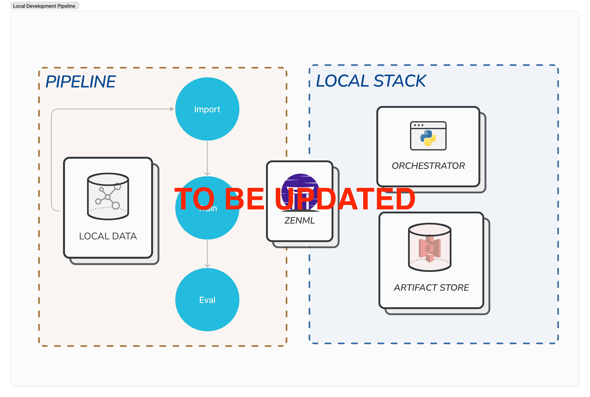
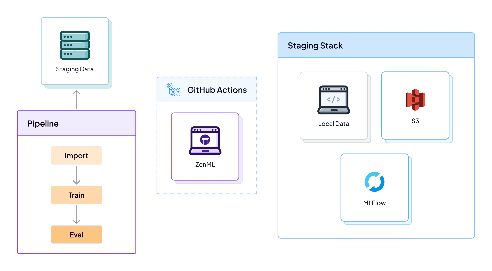
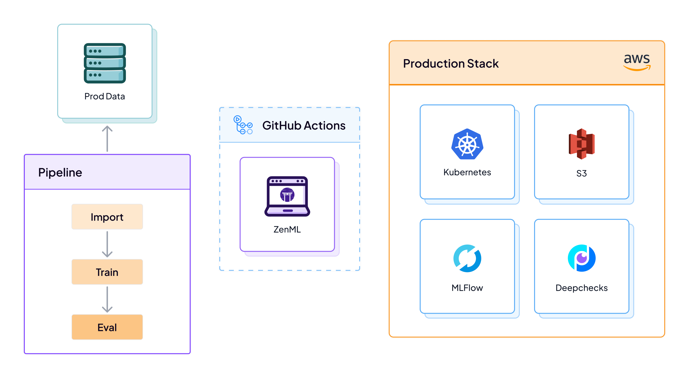

# ZenML - GitHub Action Workflow

<div align="center">
  <a href="https://zenml.io">
    
  </a>

  <h3 align="center">Build portable, production-ready MLOps pipelines.</h3>

  <p align="center">
    A simple yet powerful open-source framework that integrates all your ML tools.
    <br />
    <a href="https://docs.zenml.io/"><strong>Explore the docs »</strong></a>
    <br />
    <div align="center">
      Join our <a href="https://zenml.io/slack-invite" target="_blank">
      
    <b>Slack Community</b> </a> and be part of the ZenML family.
    </div>
    <br />
    <a href="https://zenml.io/features">Features</a>
    ·
    <a href="https://zenml.io/roadmap">Roadmap</a>
    ·
    <a href="https://github.com/zenml-io/zenml/issues">Report Bug</a>
    ·
    <a href="https://zenml.io/discussion">Vote New Features</a>
    ·
    <a href="https://blog.zenml.io/">Read Blog</a>
    ·
    <a href="#-meet-the-team">Meet the Team</a>
    <br />
    <br />
    <a href="https://www.linkedin.com/company/zenml/">
    
    </a>
    <a href="https://twitter.com/zenml_io">
    
    </a>
    <a href="https://www.youtube.com/c/ZenML">
    
    </a>
  </p>
</div>


## 🖼️ Overview

This repository showcases how ZenML can be used for machine learning with a
GitHub workflow that automates CI/CD with continuous model training and
continuous model deployment to production. This allows data scientists to
experiment with data processing and model training locally and then have code
changes automatically tested and validated through the standard GitHub PR peer
review process. Changes that pass the CI and code review are then
promoted automatically to production and can be used by end-users or other workloads relying just on the `Production` model stage.

This repository is also meant to be used as a template: you can fork it and
easily adapt it to your own MLOps stack, infrastructure, code and data.

Here's an architectural diagram of what this can look like:




The workflow works as follows:

A data scientist wants to make improvements to the ML pipeline. They clone the 
repository, create a new branch, and experiment with new models or data 
processing steps on their local machine.




Once the data scientist thinks they have improved the pipeline, they create a 
pull request for his branch on GitHub. This automatically triggers a GitHub Action 
that will run the same pipeline in the staging environment (e.g. a pipeline 
running on a local orchestrator with a remote artifact store), with a staging data set version. As long as the pipeline does not run successfully in the staging environment, the PR
cannot be merged. The pipeline also generates a set of metrics and test results
that are automatically published to the PR, where they can be peer-reviewed to
decide if the changes should be merged.



Once the PR has been reviewed and passes all checks, the branch is merged into 
`staging`. Now `staging` branch contains changes verified by the development team separately on their feature branches, but before reaching `main` it should still pass end-to-end validation on production data using cloud stack (e.g. Kubernetes orchestrator deployed on AWS EKS with remote MlFlow and remote Artifact Store on S3). To make this happen another GitHub Action runs once a PR from `staging` to `main` is opened, which trains the collaborative model changes on 
production data, runs some checks to compare its performance with the model
currently served in production and then, if all checks pass allow a merge to `main`.



Once the code reaches `main` another GitHub Action runs, which promotes the previously validated model version to `production` and from now on it can be used by various consumers (end-users via endpoints, batch prediction pipelines or other consumers).


The pipeline implementations follow a set of best practices for MLOps summarized
below:

* **Model Control Plane**: All artifacts, pipeline runs, models and endpoints are gathered under one roof of a [ZenML Model version](https://docs.zenml.io/user-guide/starter-guide/track-ml-models). Model versions are named with your GitHub Commit SHA, so you can always refer to the original code changed which produced a specific model version. 
* **Experiment Tracking**: All experiments are logged with an experiment tracker
(MLflow), which allows for easy comparison of different runs and models and
provides quick access to visualization and validation reports.
* **Data and Model validation**: The pipelines include a set of Deepchecks-powered
steps that verify the integrity of the data and evaluate the model after
training. The results are gathered, and analyzed and then a report is generated with
a summary of the findings and a suggested course of action. This provides useful
insights into the quality of the data and the performance of the model and helps to
catch potential issues early on before the model is deployed to production.
* **Pipeline Tracking**: All pipeline runs and their artifacts are of course
versioned and logged with ZenML. This enables features such as lineage tracking,
provenance, caching and reproducibility.
* **Continuous Integration**: All changes to the code are tested and validated
automatically using GitHub Actions. Only changes that pass all tests are merged
into the `main` branch. This applies not only to the code itself but also to
the ML artifacts, such as the data and the model.
* **Continuous Deployment**: When a change is merged into the `main` branch, it is
automatically promoted to production using ZenML and GitHub Actions.
* **Software Dependency Management**: All software dependencies are managed
in a way that guarantees full reproducibility and is automatically installed
by ZenML in the pipeline runtime environments. Python package versions are frozen
and pinned to ensure that the pipeline runs are fully reproducible.
* **Reproducible Randomness**: All randomness is controlled and seeded to ensure
reproducibility and caching of the pipeline runs.

## 📦 Local workflow for development and experimentation

This workflow is meant to be run on a local machine by someone who wants to make
local code changes e.g. to build a better model or to use a different
data source. Aside from training the model, the training pipeline also includes
a set of Deepchecks steps that check the data integrity and evaluate the model.
The results are gathered, analyzed and then a report with the results is
generated and printed out.

### 🏇 How to run

1. Clone the repository and create a development branch

```
git clone git@github.com:zenml-io/zenml-gitflow.git
git checkout -b <your-branch-name>
```

2. Install local requirements in a virtual environment

```
virtualenv .venv
source .venv/bin/activate
pip install -r requirements.txt
```

3. Set up your local stack

```
stacks/setup_local_stack.sh
```

NOTE: this script registers a stack that consists of the following components:

* the default local orchestrator and artifact store
* a local MLflow tracking server
* a local MLflow model deployer
* Deepchecks as a data/model validator

4. Iterate on making local code changes and run the training pipeline locally to
test your changes:

```
python run.py --pipeline training
```

A report will be printed to the console and the model as well as the metrics
and check results generated by Deepchecks will be saved in the MLflow experiment
tracker. You can view the results in the MLflow UI by starting the MLFlow UI
server on your local machine, as instructed in the run output.

You can optionally exercise the end-to-end workflow locally by running the
pipeline involved in the GitHub automated CI/CD workflow. The end-to-end
pipeline adds model deployment to model training. It also includes steps that
compare the performance of the recently trained model with the performance of
the model currently deployed:

```
python run.py --pipeline end-to-end
```

5. When you're ready, push a PR with your changes to `staging`. This will trigger
the GitHub CI workflow that will check your code changes using a different
stack running on a local orchestrator with S3 Artifact Store using the staging dataset!

## 📦 GitHub workflow for automated CI/CD

This workflow is meant to be run as part of an automated gating CI/CD job that is
triggered to test code changes before they are incorporated into the main
repository branch on GitHub.

### 🏇 How to trigger

1. publish a PR with your code changes to the GitHub repository, or push
additional to an existing PR.

2. this next part is automated with the help of GitHub Actions. A GitHub
workflow is triggered automatically when PR code changes are detected. The
workflow will run the same training pipeline as in the local setup, but this
time it will use a different dataset as input, a remote ZenML server and a cloud
ZenML stack.

The training results will be saved in the remote MLflow tracking server and the
report will be attached to the PR as a comment, where it can be analyzed by
other team members as part of the PR review process.

3. When the PR is opened to the `main`, the production workflow is triggered and
will train, evaluate and deploy a new model with K8S on AWS!

The training results will be saved in the remote MLflow tracking server and the
report will be attached to the PR as a comment, where it can be analyzed by
other team members as part of the PR review process.

4. When the PR to `main` gets merged it will promote a model version from the previous PR to `production` so it can be used by consumers.

## 📦 Software requirements management

In building ML pipelines and their dependencies for production, you want to make
sure that your builds are predictable and deterministic. This requires
Python packages to be pinned to very specific versions, including ZenML itself.

We use two sources of dependencies for this case study: 
* `requirements.txt` with basic requirements like `zenml` package
* `Makefile` with `zenml integration install ...` instructions, which ensures that external dependencies are aligned with ZenML version
